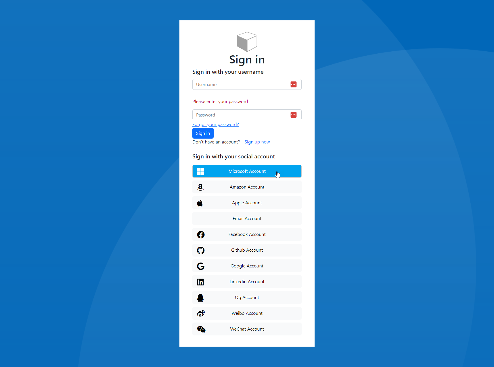

# WIP

The repo is very much a work in progress. I have a couple of goals.

1. Update from Bootstrap 3 to Bootstrap 5.
2. Unravel the messy injected CSS from the sample templates.
3. Provide a "emulator" to view what the templates might look like before uploading them.
4. Make it easier for others to customize the templates.
5. Make it easier to use other CSS frameworks.

## Get Going
The most simple thing to do is produce the outputs ready to use. To do this run and replace `example.com` with your storage account or CDN url.

```shell
node ./build/make.js --pack -d https://example.com
```

This will build the SASS for the default theme (Bootstrap5), copy the theme templates and then anything in the `your-assets` folder to a folder called `output`. Please note that `output` gets cleared every time this command runs. Use the `your-assets` folder to store you logo file, etc.

The git ignore file will not check in the `output`, `emulator` or `your-assets` folder. After cloning this repo, you may want to re-include `output` and `your-assets`.


## Bootstrap 5
I couldn't find a Azure B2C Bootstrap 5 template to start from, so I decided to make one. 
There is no source CSS that I can find to make customization easier. 

## SCSS
The SCSS in the project is my attempts to reverse engineer the "gulp injected" CSS and convert it into something usable.
I plan to keep cleaning that up as I go and trying to remove duplicate code and organize it in a way that makes sense.

## Emulator
I'm copying the inner parts of a real B2C flow, making it generic and then providing that in the samples. Running

```shell
npm run watch
```

will start a small node server that will compile the SCSS, copy any assets and combine the template pages (e.g. unified.html) 
and the sample pages (e.g. sign-in.html). The emulator/samples is not supposed to be fully functional. The main goal is 
give you an idea of what it would look like.

## Themes
While I'm attempting to build out a Bootstrap 5 theme, the code does support adding other themes. If you want to create 
your own with another frontend framework or customize the base template just follow the basic folder structure.

Under the `themes` directory, create a new folder "MyTheme". Create a `src` and `template` folder under that.
All the html files under Bootstrap5/templates/ are required to be present. You will also want an `assets` folder under 
the templates directory. This is where the output css will go.

Under the `src` directory create a SCSS file called `main.scss`, e.g. `./MyTheme/src/styles/main.scss`

To use this theme run `npm watch --theme MyTheme`

## Building
The B2C templates require a FQDN path your assets. When you are ready to upload your theme run `npm start --theme MyTheme --domain https://path.to.stuff`.
The `theme` is optional and will default to the Bootstrap 5 theme. The `domain` option should be one level above where
the assets folder get deployed. For example, `https://cdn.mysite.com/bc2/theme/[assets]` or just `https://foo.com/[assets]` or
`https://[STORAGE-ACCOUNT].blob.core.windows.net/[CONTAINER]/[assets]`

# Call for samples
It's unclear how some template pages get called. If you are working on a custom B2C setup, and you find a scenario
that is not covered by the existing samples (e.g. `b2c/api/../exception`), please either send me the inner html of the "api" element or a screenshot.
If you post these directly to a GitHub issue, please redact any private information first.


# Azure AD B2C HTML templates

In Azure AD B2C, you can craft your users' identity experiences so that the pages they're shown blend seamlessly with the look and feel of your brand. You get nearly full control of the HTML and CSS content presented to your users when they proceed through your application's identity journeys. With this flexibility, you can maintain brand and visual consistency between your application and Azure AD B2C. For more information, see how to [customize the user interface with HTML templates](https://docs.microsoft.com/azure/active-directory-b2c/customize-ui-with-html) in Azure Active Directory B2C.

This repo contains the following resources that can help you with the Azure AD B2C customization. 

- [Ocean Blue template BS5](themes/Bootstrap5)



